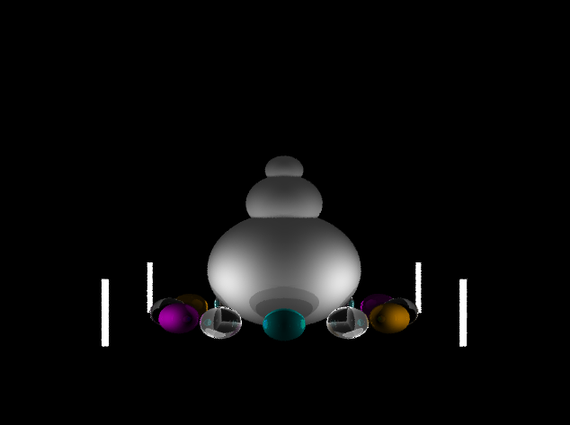

# ray_tracing
Ray tracing:

Interactive Commands:
1)Left and Right arrows should rotate by 15 degrees about a vertical axis.
2)Up and Down arrows should rotate by 15 degrees about a horizontal axis.
3)'t' key should toggles through scene rotation, ball rotation and light rotation.
4)Press 'A' to toggle anti-aliasing

Lighting includes:

1)Cook/Torrance + Blinn/Phong illumination model with diffuse, specular and ambient components.
2)Recursive depth of 4 (4 intersections), refraction and shadows.
3)Anti-aliasing, using up to 16 rays per pixel.

To Compile:
g++ main.cpp -lGL -lGLEW -lglfw -o raytracer

