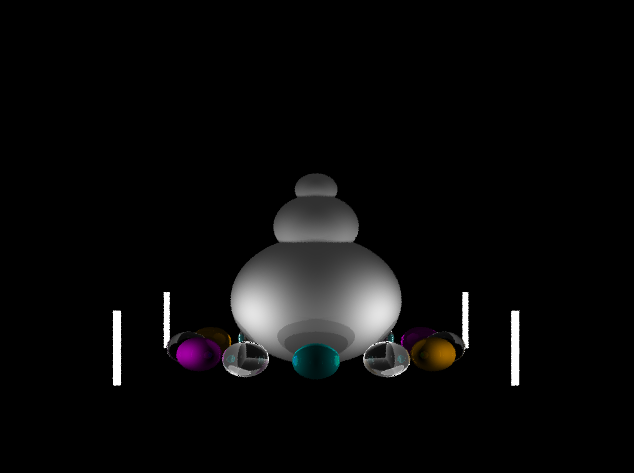
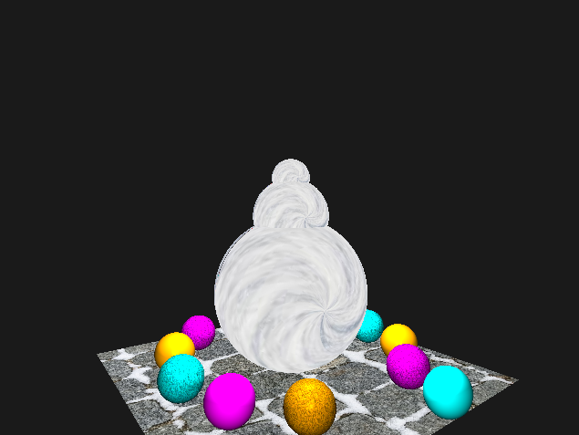

# Computer Graphics

## Introduction

This repo contains two methods of rendering snowman as part of my computer graphics COL781. The first one is using raytracing and the second one is using rasterization using opengl. 

### Dependencies

For smooth installation make sure the following libraries are installed:


1) GLEW
2) OpenGL
3) GLFW
4) GLM

version 3.0 was used while creating this project. 

## Ray Tracing


### How to compile 

Run the following command from ray_tracer folder:

```
g++ main.cpp -lGL -lGLEW -lglfw -o raytracer
```

### Interactive Commands

1) Left and Right arrows should rotate by 15 degrees about a vertical axis.<br/>
2) Up and Down arrows should rotate by 15 degrees about a horizontal axis.<br/>
3) 't' key should toggles through scene rotation, ball rotation and light rotation.<br/>
4) Press 'A' to toggle anti-aliasing (5 rays for now)

### Lighting Model

1) Fresnel + Blinn/Phong illumination model with diffuse, specular and ambient components.<br/>
2) Recursive depth of 4 (4 intersections), refraction and shadows.<br/>
3) Anti-aliasing, using up to 16 rays per pixel.<br/>



## Scene Rendering through OpenGL

## How to Run

Go to the opengl folder and run the following commands:

```
make clean
make
cd build
./gapp
```

## Interactive Commands

1) Selecting a background pixel and dragging the mouse rotates the camera (left to right or up to down). If the shift button is simultaneously pressed, the camera should move in camera-Z, depending on the mouse's Y copordinate.
2) Selecting a shiny ball and dragging the mouse translates it in Camera-X or Camera-Y (mapped respectively from mouse X and mouse Y).
3) Selecting the base sphere of the snowman and dragging rotates the entire snowman about its contact with the ground.
4) Selecting the torso of the snowman and dragging should rotate the torso and the head about the base's center.
5) Selecting the head of the snowman and dragging should rotate the head about the torso's center.



### TODO 

upload the full code for opengl after deadline (21st February).
